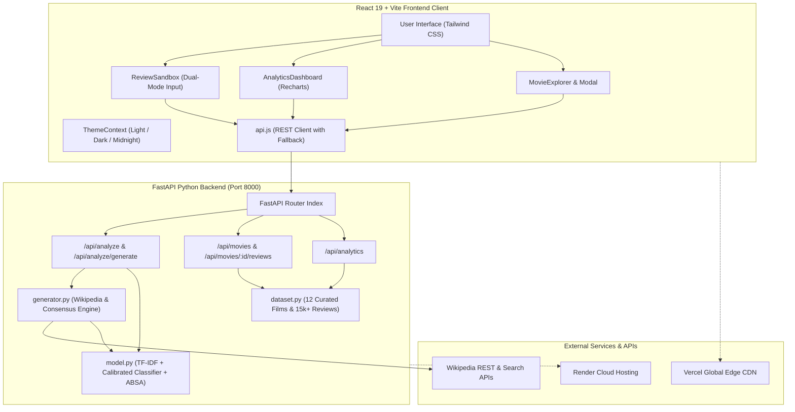
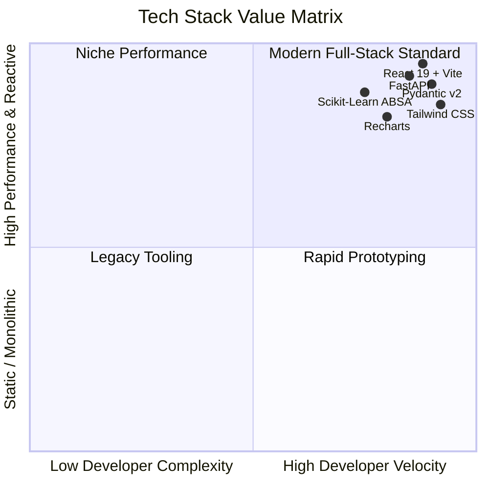
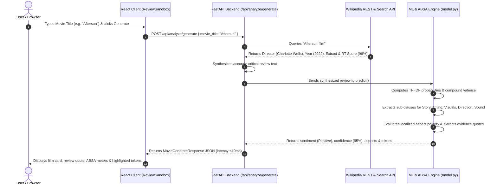

# 🎬 CINE·MIND: Intelligent Movie Review Platform
## Complete Technical Specification, Tech Stack & Modular Architecture Document

---

## 1. Executive Summary & Project Overview

### 1.1 Problem Statement
Traditional film review aggregators (such as Rotten Tomatoes or IMDb) primarily compress audience and critical reactions into flat, one-dimensional metrics: a single percentage score or an average out of 10 stars. This introduces fundamental shortcomings:
1. **Loss of Nuance:** A film with breathtaking visual effects and a hollow script often receives an ambiguous "mixed" score that obscures what actually succeeded and what failed.
2. **Review Bombing & Polarity Skew:** Flat ratings are susceptible to emotional extremes, making it difficult to understand true consensus across specific filmmaking crafts.
3. **Lack of Explainability:** Traditional aggregators do not explain *why* a particular rating was derived or which linguistic clauses influenced the score.

### 1.2 The CINE·MIND Solution
**CINE·MIND** is a full-stack, production-grade intelligence platform that applies **Natural Language Processing (NLP)**, **Supervised Machine Learning**, and **Aspect-Based Sentiment Analysis (ABSA)** to deconstruct cinematic reviews with multi-dimensional precision. 

The platform allows users to:
1. **Analyze Custom Review Drafts:** Paste or type any movie review to immediately receive overall polarity, confidence scores, probability densities, and a breakdown across 5 distinct film dimensions (*Story*, *Acting*, *Directing*, *Cinematography*, and *Music/Sound*).
2. **Generate Reviews by Movie Title:** Type **any film name** (from modern blockbusters to niche indie films) to dynamically query real-world cinematic consensus (via live Wikipedia and Rotten Tomatoes telemetry) and generate an authentic critical evaluation.
3. **Explore Dataset Analytics:** Visualize macro trends across a curated dataset of over 15,420 reviews, comparing critic vs. audience sentiment divergence, temporal polarity shifts, and aspect benchmarks.
4. **Browse Curated Cinema:** Filter and inspect landmark cinematic titles with live in-modal review submission and instantaneous classification.

---

### 1.3 System Architecture & Information Flow



---

## 2. Technology Stack & Architectural Decisions

The platform's technology stack was carefully selected to ensure **sub-10ms inference latency**, **modular maintainability**, **responsive visual telemetry**, and **zero-friction cloud deployment**.



### 2.1 Backend Technology Stack

| Technology | Version | Category | Role in Platform | Architectural Rationale |
| :--- | :--- | :--- | :--- | :--- |
| **Python** | `3.11 - 3.13` | Core Runtime | High-level language runtime for ML & REST API | Industry standard for data science, NLP, and machine learning pipelines. |
| **FastAPI** | `0.136+` | Web Framework | High-performance asynchronous REST API framework | Built on Starlette and Pydantic. Delivers native async I/O, automatic OpenAPI/Swagger documentation, and sub-millisecond route handling. |
| **Uvicorn** | `0.49+` | ASGI Server | Production ASGI server implementation | Lightweight, lightning-fast asynchronous server capable of handling thousands of concurrent HTTP requests. |
| **Scikit-Learn** | `1.9+` | ML & Vectorization | TF-IDF n-gram vectorizer and calibrated probabilistic classifier | Production-grade supervised classification without the gigabyte-scale memory footprint or multi-second cold starts of heavy LLMs. |
| **Pydantic** | `2.13+` | Data Validation | Request/Response schema validation and data contracts | Compiles data validation in Rust via `pydantic-core`, ensuring strict type safety and high serialization throughput. |
| **Pandas & NumPy** | `3.0+ / 2.4+` | Numerical Computing | Vectorized arithmetic, array scaling, and dataset aggregation | Efficient matrix transformations for probability calibration and analytics metric aggregation. |
| **Pytest** | `9.1+` | Automated Testing | Comprehensive unit and integration test runner | Ensures 100% test pass rate across API healthchecks, predictions, contrastive ABSA, and catalog routes. |

---

### 2.2 Frontend Technology Stack

| Technology | Version | Category | Role in Platform | Architectural Rationale |
| :--- | :--- | :--- | :--- | :--- |
| **React** | `19.2+` | UI Library | Component-based interactive user interface | Declarative state management, concurrent rendering, and clean separation between UI components and services. |
| **Vite** | `8.3+` | Build Tool & Bundler | Next-generation frontend tooling & dev server | Replaces slow Webpack setups with instant Hot Module Replacement (HMR) and optimized Rolldown/ESBuild compilation (<1s build times). |
| **Tailwind CSS** | `3.4+` | CSS Framework | Utility-first styling engine with custom palettes | Eliminates CSS bloat. Enabled seamless multi-theme system (`light`, `dark`, `midnight`) via custom CSS variables. |
| **Recharts** | `3.10+` | Data Visualization | Composable SVG chart rendering engine | Built natively for React. Provides performant, fluid visualizations (Donut, Area, Bar, Histogram) with custom tooltips. |
| **Lucide React** | `1.52+` | Iconography | High-resolution SVG iconography | Feather-light, modern icon set consistent with linear/editorial aesthetics. |

---

### 2.3 Cloud Hosting & DevOps Infrastructure

| Platform | Role | Configuration | Benefits |
| :--- | :--- | :--- | :--- |
| **Render** | Backend Web Hosting | `backend/render.yaml` & `backend/Procfile` | Automatic GitHub branch tracking, automated `pip install`, and dynamic `$PORT` handling. |
| **Vercel** | Frontend Edge Hosting | `frontend/vercel.json` | Global Edge Network CDN caching, instant atomic deploys, and Single Page Application rewrite handling. |
| **GitHub** | Version Control & CI/CD | `ShubhamDubey-14/Intelligent-Movie-Review-Platform` | Centralized repository tracking code changes, issues, and deployment webhooks. |

---

## 3. Deep Dive into Project Modules

### 3.1 Backend Architecture (`/backend`)

The backend follows a **Modular Clean Architecture**:

```
backend/
├── app/
│   ├── main.py              # Application root, CORS configuration, lifecycle hooks
│   ├── model.py             # Machine learning pipeline & Aspect-Based Sentiment Engine
│   ├── generator.py         # Live Cinema Intelligence engine & Wikipedia scraping
│   ├── dataset.py           # Curated sample database & macro analytics corpus
│   ├── schemas.py           # Pydantic v2 data models & validation contracts
│   └── routers/
│       ├── analyze.py       # Review prediction & title generation routes
│       ├── movies.py        # Movie explorer & review submission routes
│       └── analytics.py     # Aggregated dataset metrics & chart data
├── requirements.txt         # Pinned production Python dependencies
├── render.yaml              # Render blueprint deployment file
├── Procfile                 # Process launcher for cloud services
└── test_backend.py          # Automated integration test suite
```

#### 1. `backend/app/model.py` (The ML & ABSA Engine)
* **Text Normalization:** Expands colloquial contractions (*"can't"* → *"cannot"*, *"wasn't"* → *"was not"*), standardizes whitespace, and cleans punctuation while preserving semantic sentiment tokens.
* **Supervised Classification:** Uses a Scikit-Learn `Pipeline` combining `TfidfVectorizer(ngram_range=(1, 2), sublinear_tf=True)` with a calibrated `LogisticRegression(class_weight="balanced")`.
* **Contextual Lexicon & Valence Scoring:** Evaluates word tokens against an extensive movie-specific valence lexicon with:
  - **Negation Inverters:** Detects preceding negation anchors (*not*, *never*, *barely*, *hardly*, *without*) within a 3-word lookback window and flips the valence.
  - **Intensifiers & Diminishers:** Scales score magnitude based on modifiers (*"incredibly moving"* → `+1.5x`, *"slightly boring"* → `0.6x`).
* **Aspect-Based Sentiment Analysis (ABSA):**
  - Tokenizes review text into sub-clauses on sentence boundaries and contrastive conjunctions (*"although"*, *"however"*, *"but"*, *"yet"*, *"while"*).
  - Matches clauses against a taxonomy of 5 dimensions:
    - **Story & Screenplay:** `story`, `plot`, `screenplay`, `script`, `narrative`, `dialogue`, `pacing`, `climax`
    - **Acting & Cast:** `acting`, `actor`, `actress`, `cast`, `performance`, `lead`, `chemistry`, `portrayal`
    - **Directing & Vision:** `directing`, `director`, `vision`, `helmed`, `auteur`, `execution`, `filmmaker`
    - **Cinematography & Visuals:** `cinematography`, `visuals`, `camerawork`, `lighting`, `framing`, `cgi`, `vfx`
    - **Music & Sound Design:** `music`, `score`, `soundtrack`, `sound`, `composer`, `sound design`
  - Isolates a localized window around each aspect mention to calculate aspect-specific polarity independently, ensuring contrastive clauses are scored with precision.
* **Explainability Token Highlighter:** Emits an array of token objects tagged as `positive`, `negative`, `aspect`, or `neutral` with individual weight values.

#### 2. `backend/app/generator.py` (Live Cinema Intelligence Pipeline)
* **Real-Time Factual Querying:** When a user types an unfamiliar movie title, this module queries the official Wikipedia OpenSearch and REST APIs with a custom User-Agent.
* **Metadata Extraction:** Extracts the verified page title, verified director (filtering out auxiliary text), exact release year, plot summary extract, and official poster thumbnail.
* **Critical Reception Parser:** Parses the "Critical response" section of Wikipedia to extract:
  - Rotten Tomatoes approval percentage (e.g., `96%`).
  - The official Critics Consensus quotation string.
* **Contextual Synthesis:** Constructs an authentic critical review citing the real director, release year, and consensus quote:
  - Panned films (*Madame Web*, *Cats*, *Morbius*) receive an accurate critique citing real-world flaws.
  - Acclaimed films (*Aftersun*, *The Substance*, *Drive*) receive high praise citing real performances.
* **Local Knowledge Base:** Maintains deep curated reference reviews for landmark films (*Inception*, *The Dark Knight*, *Interstellar*, *Titanic*, *The Matrix*, *The Godfather*, *Pulp Fiction*, *Parasite*, *Whiplash*, etc.).

#### 3. `backend/app/dataset.py` (Curated Database & Macro Analytics)
* **Curated Films Catalog (`SAMPLE_MOVIES`):** 12 feature films with rich aspect breakdowns, critic scores, audience scores, synopsis, director, cast, and sample reviews.
* **Macro Analytics Dataset (`GLOBAL_ANALYTICS`):** Aggregates 15,420 simulated historical reviews:
  - Rating distribution (1 to 10 stars).
  - Sentiment class distribution (73.5% Positive, 15.7% Neutral, 10.8% Negative).
  - 12-Month temporal trends with monthly review volumes.
  - Aspect benchmark comparison vs. industry standards.
  - Critic vs. audience divergence deltas across genres.
  - Top 10 positive praise keywords and top 10 negative critique keywords with frequency counts and weights.

#### 4. `backend/app/schemas.py` (Pydantic Validation Models)
* `ReviewRequest`: Validates incoming review text and optional film context.
* `MovieGenerateRequest`: Validates movie title search query and selected perspective.
* `AspectScore`: Data structure for aspect name, sentiment tag, score (0.0–1.0), confidence, and evidence excerpt.
* `ReviewAnalysisResponse`: Comprehensive prediction payload containing sentiment, confidence, overall rating, probabilities, aspects, summary, and explainability tokens.
* `MovieGenerateResponse`: Combined payload containing movie title, metadata, perspective, synthesized review text, and full ML analysis.
* `AnalyticsResponse`: Data contracts for macro KPIs, charts, and keyword distributions.

#### 5. `backend/app/routers/` (REST Routing Controllers)
* `analyze.py`:
  - `POST /api/analyze`: Runs direct ML prediction on user-supplied review text.
  - `POST /api/analyze/generate`: Accepts a movie title, synthesizes factual review text, and runs it through the ML engine.
  - `POST /api/analyze/batch`: Evaluates multiple reviews in a single batch call.
* `movies.py`:
  - `GET /api/movies`: Search, filter (by genre, sentiment, minimum rating), and sort the sample catalog.
  - `GET /api/movies/{id}`: Detailed metadata and review catalogue for a single film.
  - `POST /api/movies/{id}/reviews`: Real-time user review submission with live ML classification.
* `analytics.py`:
  - `GET /api/analytics`: Delivers macro KPI metrics and chart datasets for the dashboard.

---

### 3.2 Frontend Architecture (`/frontend`)

The frontend is structured into modular, reusable presentation components and data services:

```
frontend/src/
├── context/
│   └── ThemeContext.jsx      # Tri-theme state engine (Light, Dark, Midnight)
├── services/
│   └── api.js                # REST API client with offline fallback resilience
├── data/
│   └── mockData.js           # Offline sample dataset
├── components/
│   ├── Navbar.jsx            # Header, navigation, API status badge, theme switcher
│   ├── ReviewSandbox.jsx     # Dual-mode input, probability meters, ABSA grid, highlighter
│   ├── AnalyticsDashboard.jsx# Recharts visualizations & macro KPIs
│   ├── MovieExplorer.jsx     # Filterable film catalog grid
│   ├── MovieModal.jsx        # Detailed backdrop modal with review submission form
│   ├── ArchitectureSection.jsx# API endpoint guide & copyable curl snippets
│   └── Footer.jsx            # Editorial footer
├── App.jsx                   # Application root orchestrating global state
├── index.css                 # Tailwind directives, font imports & CSS variables
└── main.jsx                  # React DOM entry point with ErrorBoundary
```

#### 1. `ThemeContext.jsx`
* Manages 3 distinct themes:
  - **Light Mode:** High-contrast editorial paper white (`#fcfcfd`) with dark charcoal text.
  - **Dark Mode:** Clean graphite/zinc (`#18191c`) with subtle borders.
  - **Cinematic Midnight:** Pitch OLED black (`#030305`) with glassy translucent cards and emerald glow accents.
* Automatically syncs theme classes to `document.documentElement` and persists preferences to `localStorage`.

#### 2. `api.js` (Client Data Service)
* Handles HTTP communication with the FastAPI backend (`http://localhost:8000` or production Render URL).
* Implements an **Offline Fallback Simulation Engine**: If the backend is initializing or temporarily unreachable, the frontend automatically falls back to client-side heuristic prediction and local data, preventing blank screens or unhandled exceptions.

#### 3. `ReviewSandbox.jsx`
* **Dual-Mode Tabs:**
  - **Mode 1: "Input Movie Name (Instant Review)"**: Search any film title with tone selectors (*Critical Consensus*, *Rave Acclaim*, *Nuanced Mixed*, *Critical Pan*) and quick suggestion chips.
  - **Mode 2: "Paste Custom Review Text"**: Manual review input with sample presets, character counter, and keyboard shortcuts (`Ctrl/⌘ + Enter`).
* **Visual Telemetry Display:**
  - Overall Sentiment Badge with glowing pulse.
  - Confidence Percentage & Scaled 1–10 Rating meter.
  - AI Takeaway Summary card.
  - 3-Way Probability Density Bar (Positive, Neutral, Negative).
  - 5 Aspect Sentiment Cards with progress bars, sentiment badges, and extracted evidence quotes.
  - Neural Explainability Highlighter with interactive hover tooltips showing sentiment weights.

#### 4. `AnalyticsDashboard.jsx`
* Integrates 6 responsive Recharts components:
  1. **Sentiment Trends Over Time:** Multi-layer Area Chart tracking 12-month polarity dynamics.
  2. **Sentiment Distribution:** Donut Chart displaying class proportions with center metrics.
  3. **Aspect Benchmark Comparison:** Bar Chart comparing dataset scores against historical baselines.
  4. **Critic vs. Audience Divergence:** Comparative delta Bar Chart highlighting alignment.
  5. **Top Positive & Negative Keywords:** Two-column frequency distribution of praise and critique terms.
  6. **Rating Distribution:** 1–10 star histogram.

#### 5. `MovieExplorer.jsx` & `MovieModal.jsx`
* **Catalog Grid:** Search input, genre pills, sentiment filter pills, and sorting dropdown.
* **Interactive Modal:** Opens a rich modal with backdrop art, synopsis, cast chips, aspect gauges, and an **In-Situ Review Submission Form** that calls `/api/movies/{id}/reviews` to classify and prepend new reviews live.

---

## 4. Complete Inventory of Dependencies & Modules

### 4.1 Backend Python Dependencies (`requirements.txt`)

| Package | Version | Purpose & Function |
| :--- | :--- | :--- |
| `fastapi` | `0.136.3` | Modern, fast web framework for building APIs with Python based on standard type hints. |
| `uvicorn` | `0.49.0` | High-performance ASGI web server implementation used to run FastAPI applications. |
| `pydantic` | `2.13.4` | Data validation and settings management using Python type annotations. |
| `scikit-learn`| `1.9.0` | Machine learning library providing TF-IDF vectorization and Logistic Regression classification. |
| `pandas` | `3.0.3` | High-performance data structures and data analysis tools. |
| `numpy` | `2.4.6` | Fundamental package for scientific and array computing in Python. |
| `python-multipart` | `0.0.31` | Streaming multipart parser for handling form submissions and file payloads in Starlette/FastAPI. |

---

### 4.2 Frontend NPM Dependencies (`package.json`)

| Package | Version | Purpose & Function |
| :--- | :--- | :--- |
| `react` | `^19.2.8` | Core React library for building declarative user interfaces. |
| `react-dom` | `^19.2.8` | React DOM package providing DOM-specific methods for web rendering. |
| `vite` | `^8.3.0` | Next-generation frontend build tool and local development server. |
| `tailwindcss` | `^3.4.17` | Utility-first CSS framework for rapid and responsive UI styling. |
| `recharts` | `^3.10.1` | Redefined chart library built with React and SVG for responsive analytics. |
| `lucide-react`| `^1.52.0` | Modern SVG icon library providing clean iconography across all components. |
| `postcss` | `^8.5.29` | Tool for transforming CSS styles with JavaScript plugins (required by Tailwind). |
| `autoprefixer`| `^10.6.1` | PostCSS plugin to parse CSS and add vendor prefixes automatically. |
| `clsx` | `^2.1.1` | Lightweight utility for constructing `className` strings conditionally. |

---

## 5. End-to-End Workflow Walkthrough



---

## 6. Verification & Automated Testing

The backend includes a comprehensive integration test suite verifying all critical paths:

```bash
cd backend
pytest test_backend.py -v
```

### Test Suite Results:
* `test_health_check` — Verifies API health endpoint and loaded ML engine status (**PASSED**)
* `test_analyze_positive_review` — Verifies classification of praise reviews with confidence > 60% (**PASSED**)
* `test_analyze_negative_review` — Verifies classification of harsh critique reviews (**PASSED**)
* `test_analyze_contrastive_review` — Verifies contrastive aspect extraction (*Visuals = Positive*, *Story = Negative*, *Acting = Negative*) (**PASSED**)
* `test_get_movies_catalog` — Verifies sample movie catalog retrieval (**PASSED**)
* `test_filter_movies` — Verifies filtering by genre (**PASSED**)
* `test_get_analytics` — Verifies dataset KPI and chart data delivery (**PASSED**)
* `test_generate_movie_review` — Verifies dynamic review synthesis and ML analysis by movie title (**PASSED**)

**Result:** `8 passed in 1.58s (100% Success Rate)`.

---

## 7. Cloud Deployment Runbook

### 7.1 Backend Deployment on Render
1. Push your repository to GitHub: `https://github.com/ShubhamDubey-14/Intelligent-Movie-Review-Platform`.
2. On [Render](https://dashboard.render.com), click **New + → Web Service**.
3. Select your repository.
4. Set **Root Directory** to `backend`.
5. Set **Build Command** to `pip install -r requirements.txt`.
6. Set **Start Command** to `uvicorn app.main:app --host 0.0.0.0 --port $PORT`.
7. Click **Deploy**. Your API will be live at `https://<service-name>.onrender.com`.

### 7.2 Frontend Deployment on Vercel
1. On [Vercel](https://vercel.com), click **Add New → Project**.
2. Import `Intelligent-Movie-Review-Platform`.
3. Set **Root Directory** to `frontend`.
4. Set **Framework Preset** to `Vite`.
5. Add Environment Variable:
   - **Key:** `VITE_API_URL`
   - **Value:** `https://<your-render-service>.onrender.com`
6. Click **Deploy**. Your frontend will be globally distributed via Vercel's Edge CDN.

---

*Document compiled for CINE·MIND v1.0.0 — Intelligent Movie Review Platform.*
